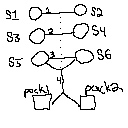

# Assignment 5—Planning

## Warehouse Robots!

Welcome to your new job at _BroadLeaf_ (CEO Jason R. Wilson-Bezos\*).
You've been tasked with helping write the managerial software for the 
new high-tech warehouses located in New Seattle.

The job is pretty straightfoward: _BroadLeaf_ has a number of fancy 
pallet-moving robots that can help out in their warehouses, but they
haven't yet written software to control them. That's where you come
in, given your knowledge of computer science (and the fact that you're
an intern, which means that you're super cheap). You'll be applying
that knowledge on getting these robots to move stock around the 
warehouse.

The robots are capable of picking up pallets and moving them around 
the warehouse. Strong they might be, dextrous they are not. They can
get the pallets to the unloading area, but they need to rely on humans
to take the specific items off of them. This is typical of the real
world, where robots are _really_ good at parts of tasks that humans
fail at, but drop the ball completely when it comes to things like 
fine motor control.

\*The "R" stands for "Robotto."

## Your Task

* Fill in the domain file so that the remote planner can create a plan
to solve each of first five problem definitions.

You have been given _seven_ problem definitions and a skeleton of a 
domain file. The first five are problems that your domain needs to be
able to solve, the sixth and seventh are problems that your domain
should __fail to create a plan for__. This is to help you verify that
you're creating a domain that accounts for things like, e.g., not 
allowing an individual stock item to be in multiple shipments. _There
will be tests like this in our grading setup_. You will get graded on
whether you pass/fail tests that we expect you to.

### The Online Editor

You can find the online .pddl editor [here](
http://editor.planning.domains/#).

* You can upload all of the files that we've distributed using
`File>Load`.
* When you're ready to test, you can click `Solve`, select the domain
and problem definitions that you'd like to use, and then click `Plan`.
The system will run for a bit (for more complicated problems, upwards
of ten seconds) and then give you the results.
* Regularly save your work in GitHub.  Using `File>Save`, download
your work and push it to GitHub.  We will only be grading files
that you have pushed to GitHub

### The Domain File

We've given you a (very sparse) domain file. It contains the domain
name and the relevant PDDL requirements:

```
(define (domain sokorobotto)
  (:requirements :typing)
  (:types  )
  (:predicates  )
)
```

Your job is to add a number of things:

1. The `:types` of all of the objects in your domain.
2. The names of all of your `:predicates`. For the sake of grading, you
need to at a minimum include the predicate `includes`. You'll want a
bunch of intermediate predicates, too, but you can name them whatever
you want. For the record, our domain definition has about fifteen.
3. The bodies of all of these actions, including parameters, pre-conditions, 
and effects.


### Testing Your Work

We've given you a total of seven problem definitions. The first five
are tests that you need to pass. They increase in complexity, so don't
be surprised if initially you pass the first few but not the later 
ones.

The problem5_fail.pddl and problem6_fail.pddl are tests that you __should fail__. 
They're there to validate that your pre-conditions and effects are in good
shape.

## Notes

* For an example domain/problem definition, you can click on `Import`.
There are a ton of old definitions from, e.g., planning competitions.
We looked at the IFC-2011 "barman" problem for guidance on how to 
write our PDDL files. You may find this useful.

* One of the more confusing things about PDDL (at least for me,
Bender) is that not every predicate in the list of predicates is an 
action. For instance, `includes` (the only predicate that you must
define) isn't an action, but things that, e.g., move pallets around
are.

* Mr. Wilson-Bezos, in a show of kindness, drew out the Problem 4 
warehouse layout for you (admittedly, it was on a napkin):


